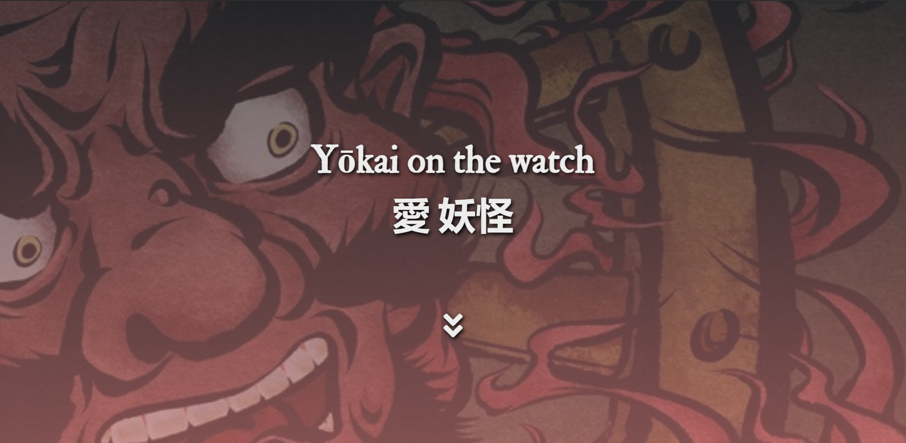
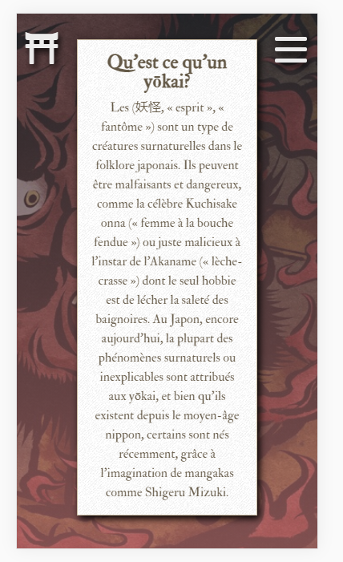
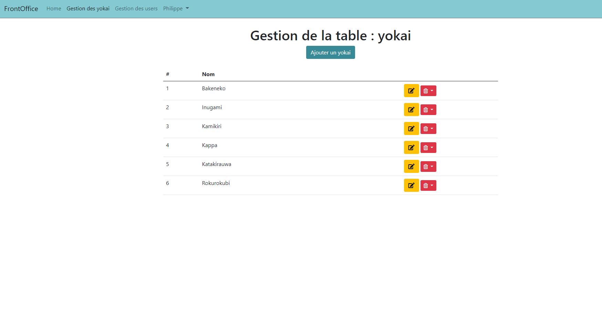

# Bienvenue sur 'Yokai on the watch' Version 2!

  

Il s'agit de la version 2 d'un projet personnel, sur le format d'un **blog**, ayant pour sujet les êtres fascinants que sont les *yōkai*.

Géré en MVC avec une base de données MySQL, j'ai également codé un **back office** pour le CRUD des articles et des users (avec token CSRF et ACL).

## Qui suis-je?

J'ai quitté mon travail dans la biologie médicale et j'ai commencé une formation intensive avec O'clock (https://oclock.io/formations/developpeur-web), il y a 3 mois.
Il y a 2 mois, j'avais mis en pratique mes premières lignes de code sur la V1 de **yokai on the watch** qui est visible ici (http://yokaiV1.laetitia-dev.com/) , code source ici (https://github.com/Listeriaa/Yokai)

Très attirée par le back-end, et après avoir découvert l'architecture MVC, ainsi que quelques dépendances facilitant la vie, j'ai repris mon projet personnel pour le mettre à jour avec mes nouvelles connaissances.

Ce fut également l'occasion de repenser le design.

Je suis très à l'écoute de tous les conseils ou critiques constructives sur mon projet, il y a sans doute des choses que je n'ai pas fait selon les règles de l'art.

## Langages/technos

* HTML
* CSS
* Javascript Vanilla
* Bootstrap pour le back-office
* PHP
* Framework crée pendant ma formation avec O'clock
* Composer

## Comment l'utiliser

- `composer install` pour installer les dépendances
- éditer votre code à l'exception des fichiers sous `oFramework` namespace
- ajouter vos routes dans  [`app/routes.php`](app/routes.php) et vos datas ACL et CSRF dans [`app/security.php`](app/security.php)
- configurer l'accès a la base de données dans le fichier `app/config.ini` (voir [`app/config.ini.dist`](app/config.ini.dist) pour l'exemple)

## Responsive

Oui!  il a également été développé en mobile-first, que ce soit le front-office ou le back-office.

## Progression et améliorations à venir
### Progression
Je souhaite une page recensant toutes les ressources concernant les Yokai : livres, manga, sites, podcasts...
Toute cette partie reste à coder (le front et le back-office). Le travail de recherche de sources est important et le rythme intensif de la formation ne m'a pas permis de m'en occuper.

### Améliorations à venir
Pour la V3, j'aimerais :
- Basculer sur un skeleton Symfony ou tester quelques composants (formulaire, dotenv...)
- Modifier le design "Yokai au hasard" de la page d'accueil pour ne plus avoir le blur de l'image (sans doute en JS)
- Optimiser les images en fonction de la taille de l'écran.
- ajouter la page "ressource" que ce soit en front-office ou en back-office.

## Version en ligne

Il est visible à l'adresse suivante (http://yokai.laetitia-dev.com/), vous pourrez également trouver la V1 ici (http://yokaiV1.laetitia-dev.com/)

## Aperçu

Je mets un screen pour chaque version : mobile et PC du front-office.

                       

Et voici un apercu du back-office:

 

## Contributions

Je suis ouverte à tous conseils ou critiques sur mon travail.
